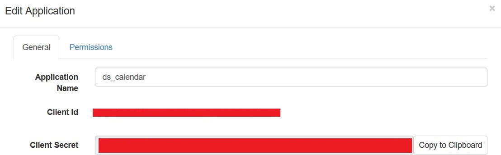
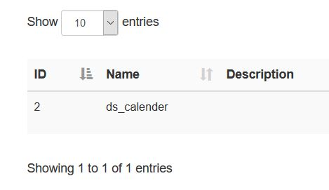

# 3ahitm_itp_ds_calendar
## Installation Guide
Before you can start this app you have to install the modules.
```
npm install
```
For this app you need a Xibo-DataSet with 2 columns and an Application.

At first you have to change the [config.example.js](config.example.js) to config.js or just copy and rename it.
After that you have to set the values:

You can find the Client Id & Client Secret avaible at _Applications_ - Settings of the particular applicaton.



DataSet Id can be found under _DataSet_.



Finally the Xibo Host is your server address of your Xibo.

To start this app you have to use the following command.
```
npm start
```


